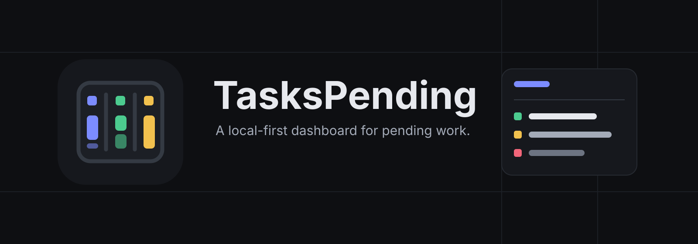
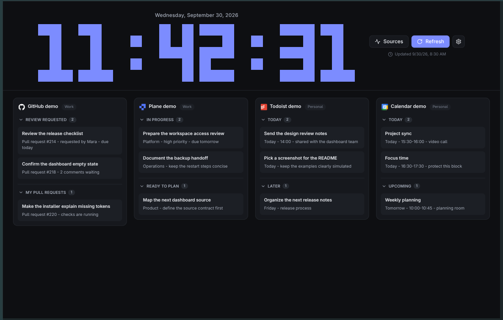
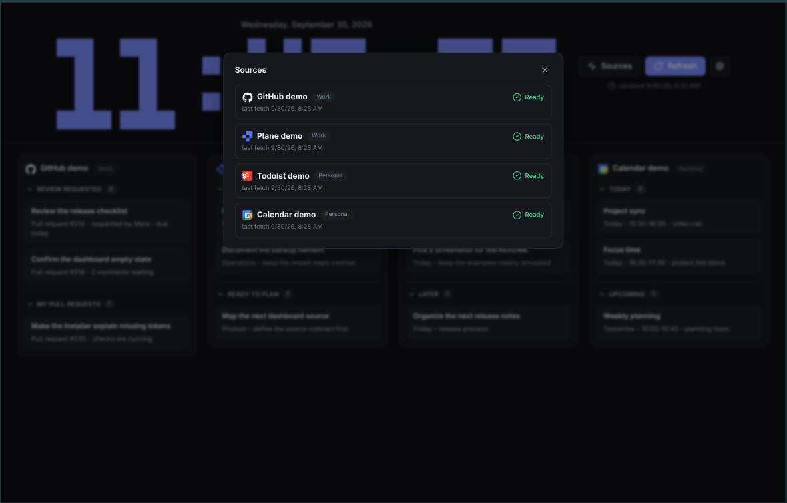
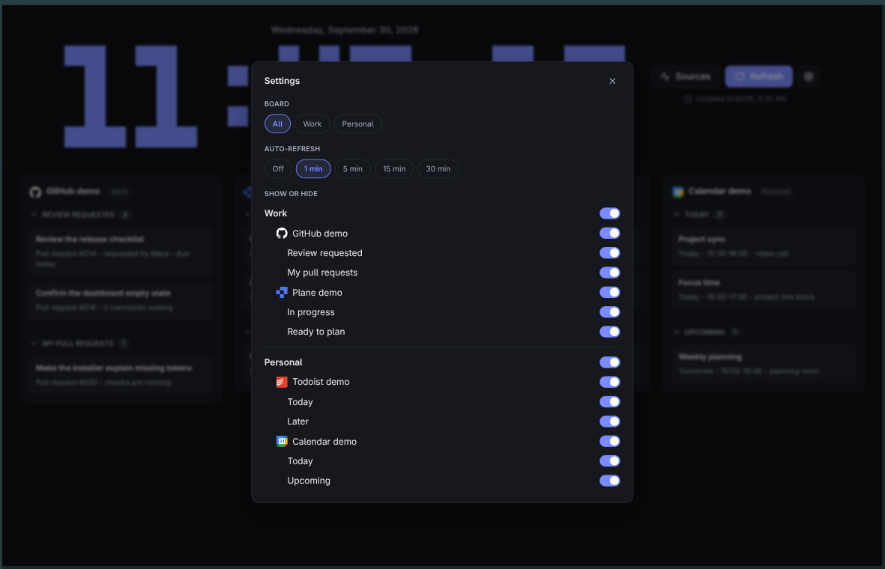

# TasksPending



TasksPending is a local-first pending-work dashboard. It collects auto-refreshing sources and shows the same model through a Rust TUI, a Rust HTTP API, and a lightweight TypeScript frontend.



<p align="center">
  
  
</p>

## Install

Install the latest release and start the dashboard:

```sh
curl --proto '=https' --tlsv1.2 -fsSL https://github.com/brunoomariano/TasksPending/releases/latest/download/tasks-pending-install.sh | sh
```

The installer selects the matching artifact, checks its SHA-256 and starts the user service at <http://127.0.0.1:61000>. Run the same command to update; configuration, tokens and service overrides stay in place. [docs/install.md](docs/install.md) covers source configuration, manual installs and the Omarchy web app.

## Platform Focus

Arch Linux is the supported operational target right now. Release automation also builds generic Linux and macOS bundles to catch portability regressions, but Arch receives the package and installation validation.

## Quick Start (development)

```sh
make bootstrap
make ci-check
make tui
```

Run the API:

```sh
make up
curl http://127.0.0.1:61000/healthz
curl http://127.0.0.1:61000/api/v1/snapshot
```

Configure sources by copying `config.example.toml` to `~/.config/tasks-pending/config.toml`; without it the API serves a built-in sample source. See [docs/operations.md](docs/operations.md).

Run the API and the built web dashboard together, then open http://127.0.0.1:61000:

```sh
make serve
```

Run a credential-free dashboard with deterministic simulated cards at http://127.0.0.1:61001:

```sh
make sandbox
```

The sandbox ignores your config, environment, cache, and external sources. It is intended for trying the dashboard and capturing documentation screenshots.

Or run the frontend dev server (proxies `/api` to `make up`):

```sh
make frontend-dev
```

## Repository Shape

- `crates/pending-core`: shared domain model, config types, and source contracts.
- `crates/pending-runtime`: refresh scheduling and in-memory source state.
- `crates/pending-github`: GitHub source adapter.
- `crates/pending-plane`: Plane source adapter.
- `crates/pending-google`: Google Calendar source adapter (GNOME Online Accounts).
- `crates/pending-ical`: calendar (iCal) source adapter.
- `crates/pending-todoist`: Todoist source adapter.
- `crates/pending-api`: HTTP API and embedded frontend delivery.
- `crates/pending-tui`: terminal dashboard.
- `crates/tasks-pending`: released CLI with `serve` and `tui` subcommands.
- `frontend`: vanilla TypeScript UI built with Vite.
- `docs`: architecture and operation notes.

## Current State

The source contract (`PendingSource`) and the snapshot rules live in `pending-core`; see [docs/architecture.md](docs/architecture.md). The API loads sources from the config file and refreshes them through `pending-runtime`. Each source is a group of stacks, and each stack is a filter declared in the config; groups and stacks follow the file order, and boards (Work, Personal, …) filter the page and are the TUI's tabs. Sources available: `github` (search queries), `plane` (work item filters), `google` (Google Calendar via GNOME Online Accounts), `ical` (any iCal feed), `todoist` (Todoist filters) and the built-in `sample`. The TUI runs the same runtime in-process (no API needed). Release builds embed the web dashboard in `tasks-pending`; `--static-dir` remains a development override.

## Inspiration

The first source target is inspired by:

- [`akitaonrails/ghpending`](https://github.com/akitaonrails/ghpending): GitHub pending issues, pull requests, alerts, token fallback, and terminal digest.
- [`akitaonrails/clock-tui`](https://github.com/akitaonrails/clock-tui): Ratatui interface, independent refresh widgets, config-first operation, and release packaging.
