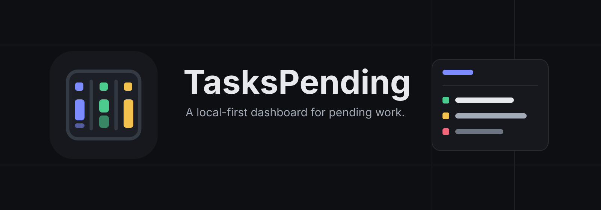
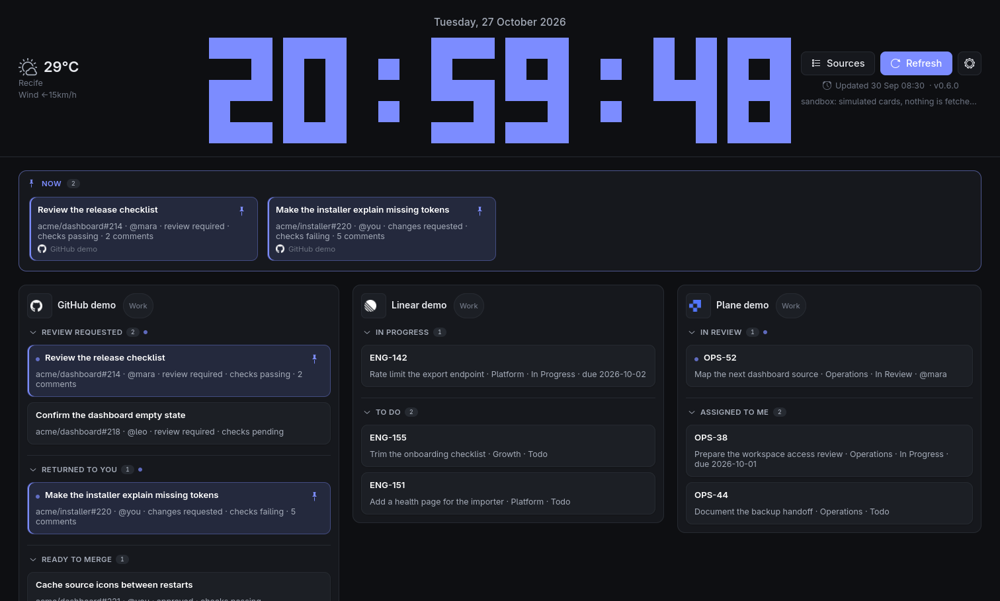

# TasksPending



TasksPending is a local-first dashboard of your pending work: pull requests, issues, tasks and events from the tools you use, in one native Linux window. A small daemon refreshes the sources in the background; the window reads it.



The picture comes from `tasks-pending sandbox`, which shows simulated cards without any configuration or credentials; `make screenshots` regenerates it.

## What it shows

- **One group per source, in your order.** GitHub, GitLab, Jira, Linear, Plane, Todoist, Google Calendar and iCal feeds, each with its logo. Inside a group, every stack is a filter you declare in the config; stacks collapse, and long ones show their first cards.
- **What to do next.** GitHub pull requests are split by next action (review requested, returned to you, ready to merge, not approved yet, drafts), with review state, checks and comment counts on the card.
- **Now.** Pin the cards you are working on: they are highlighted in place and repeated in a row at the top.
- **Snooze.** Hide a card for an hour, until tomorrow, until next week, or until it changes. It always comes back when the item changes, and nothing is written to the provider.
- **What changed.** A small dot marks the cards that changed since you last looked.
- **Local only.** The daemon listens on this machine, reads tokens from the environment, and keeps your marks and snoozes in a state folder. The window talks to it over loopback and never to the providers.

The window follows the system's dark or light scheme with its own palette.

## Install

Install the latest release and start everything:

```sh
curl --proto '=https' --tlsv1.2 -fsSL https://github.com/brunoomariano/TasksPending/releases/latest/download/tasks-pending-install.sh | sh
```

On Arch Linux it installs the release's package; elsewhere on Linux x86_64 it unpacks the release under `~/.local/lib/tasks-pending` and links `~/.local/bin/tasks-pending`. Every download is checked against its published checksum. It ends with `tasks-pending setup`, which creates the config files if they are missing, installs the launcher entry and starts the user service. Later, `tasks-pending upgrade` fetches the next release the same way. [docs/install.md](docs/install.md) covers sources, tokens, the Omarchy shortcut and manual installs.

Then open **TasksPending** from the launcher, or run `tasks-pending`.

## Platform

Linux x86_64, with Arch Linux and Omarchy as the operational target. The window is GTK4 and libadwaita (4.14 and 1.5 or newer).

## Quick start (development)

```sh
make doctor           # Rust, pkg-config, gtk4 and libadwaita development files
make bootstrap
make ci-check
make sandbox          # the window over simulated cards
```

Run the daemon and the window over it:

```sh
make up               # the daemon on 127.0.0.1:61000
make app              # the window; without a daemon it runs the sources itself
curl http://127.0.0.1:61000/healthz
```

Configure sources by copying `config.example.toml` to `~/.config/tasks-pending/config.toml`; without it the daemon serves a built-in sample source. See [docs/operations.md](docs/operations.md).

`make deploy` builds a release, installs it under `~/.local` and restarts the daemon on this machine.

## Repository shape

- `crates/pending-core`: shared domain model, config types, source contracts and release helpers.
- `crates/pending-runtime`: refresh scheduling, the in-memory source state, marks, snoozes and looks.
- `crates/pending-http`: HTTP helpers shared by the source adapters.
- `crates/pending-github`, `pending-gitlab`, `pending-jira`, `pending-linear`, `pending-plane`, `pending-google`, `pending-ical`, `pending-todoist`: source adapters.
- `crates/pending-api`: the daemon's local API, the weather beside the clock and the daily release check.
- `crates/pending-client`: the window's side of that API.
- `crates/pending-app`: the GTK4 window.
- `crates/tasks-pending`: the executable: `app`, `serve`, `sandbox`, `setup` and `upgrade`.
- `packaging`: desktop entry, icons, systemd unit and the Arch `PKGBUILD`.
- `docs`: architecture and operation notes.

## Current state

The source contract (`PendingSource`) and the snapshot rules live in `pending-core`; see [docs/architecture.md](docs/architecture.md). The daemon loads sources from the config file and refreshes them through `pending-runtime`. Each source is a group of stacks, and each stack is a filter declared in the config; groups and stacks follow the file order, and boards (Work, Personal, …) filter the window. Sources available: `github` (search queries), `gitlab` (merge requests, issues and to-dos), `jira` (JQL queries), `linear` (issue filters), `plane` (work item filters), `google` (Google Calendar via GNOME Online Accounts), `ical` (any iCal feed), `todoist` (Todoist filters) and the built-in `sample`. When no daemon is running, the window starts the same runtime inside itself.

## Inspiration

- [`akitaonrails/ghpending`](https://github.com/akitaonrails/ghpending): GitHub pending issues, pull requests, alerts, token fallback, and terminal digest.
- [`akitaonrails/clock-tui`](https://github.com/akitaonrails/clock-tui): the block clock, independent refresh widgets, config-first operation, and release packaging.
- [`akitaonrails/ai-memory`](https://github.com/akitaonrails/ai-memory): the install and upgrade flow (checksummed release bundles, a versioned install directory, `setup` and `upgrade`).
